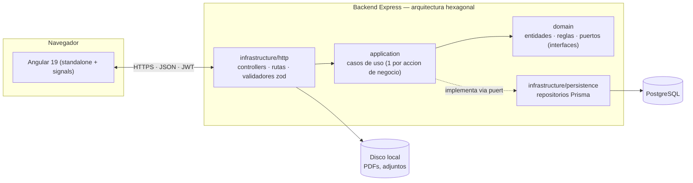
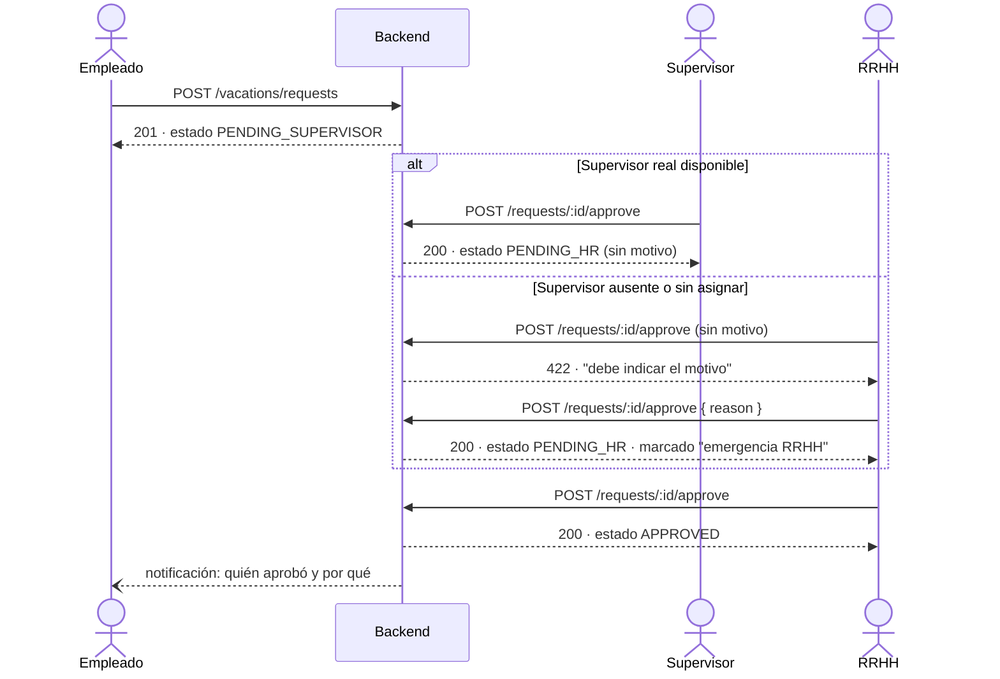
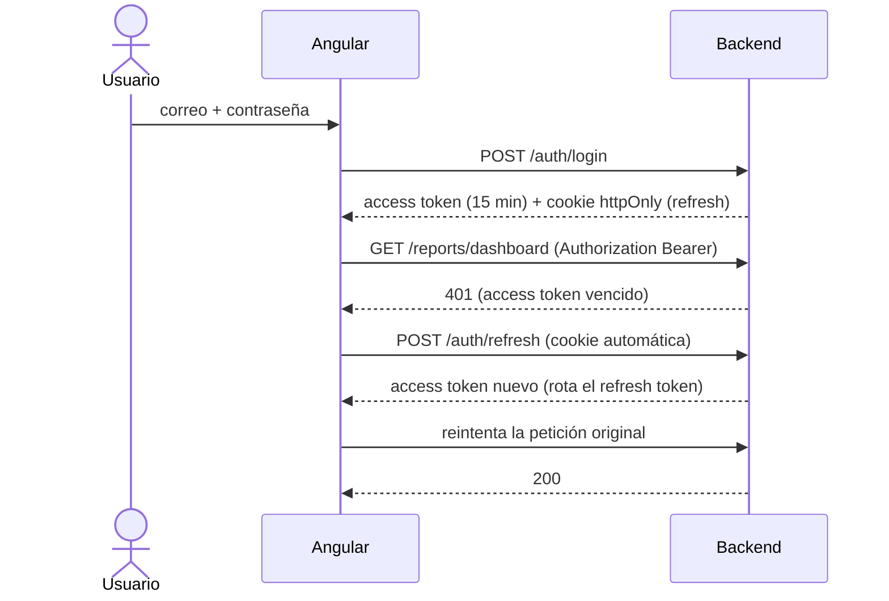

# SGRH — Sistema de Gestión de Recursos Humanos (Bolivia)

Sistema completo de gestión de personal para una empresa que opera en Bolivia, conforme a la Ley
General del Trabajo y normativa conexa (Ley 3460 de lactancia, aguinaldo, AFP, RC-IVA).

- **Backend:** Node.js + Express + TypeScript con **arquitectura hexagonal** (puertos y adaptadores).
- **Frontend:** Angular 19 con componentes *standalone*, *signals* y *lazy loading* por feature.
- **Base de datos:** PostgreSQL con Prisma (el ORM vive solo en la capa de persistencia).

> **Ningún porcentaje ni monto legal está escrito en el código.** Los días de vacación por
> antigüedad, la tasa de AFP, el RC-IVA, el salario mínimo, el aguinaldo y los recargos de horas
> extra viven en la tabla `legal_parameters`, versionados por fecha de vigencia y editables por
> RRHH desde la interfaz. Ver [§ Parámetros legales](#parámetros-legales).

---

## Arquitectura

Hexagonal (puertos y adaptadores) en el backend, SPA modular en el frontend, comunicados por una
única API REST. La regla de oro: el **dominio** (reglas de negocio) no sabe que existen Express,
Prisma o Angular — todo eso vive en los bordes (`infrastructure/`).



**Por qué importa:** `domain/` se prueba con repositorios simulados, sin base de datos ni servidor
levantado (ver `npm test`); cambiar de Prisma a otro ORM, o de Express a otro framework HTTP, no
tocaría una sola regla de negocio — solo el adaptador correspondiente.

### Reglas de la arquitectura

1. `domain/` no importa nada de `infrastructure/` ni librerías externas (**tampoco Prisma**).
2. `application/` depende de interfaces del dominio, nunca de implementaciones concretas.
3. La inyección de dependencias ocurre solo en `main.ts` (el *composition root*).
4. Cada caso de uso es una clase con una responsabilidad y se prueba con repositorios simulados.

## Comunicación cliente-servidor

- **Protocolo:** REST sobre HTTPS (certificados autofirmados en desarrollo), payloads JSON.
- **Descubrimiento de la API:** el frontend resuelve la URL del backend en tiempo de ejecución a
  partir del host desde el que se abrió (`protocol://hostname:3000/api/v1`) — la misma build sirve
  para `localhost` o para una IP de red, sin recompilar.
- **Autenticación:** JWT de acceso corto (15 min) enviado como `Authorization: Bearer`, más un
  *refresh token* en cookie `httpOnly`/`secure`/`sameSite=strict` con rotación y detección de reúso.
- **Formato de respuesta uniforme:**
  ```jsonc
  { "data": { /* ... */ }, "meta": { "total": 42, "page": 1 } }   // éxito
  { "error": { "code": "VALIDATION_ERROR", "message": "..." } }   // error
  ```
- **Validación:** todo `body`/`query`/`params` pasa por un esquema `zod` antes de llegar al caso de
  uso — el controller nunca confía en la forma del request.
- **Archivos:** subida vía `multipart/form-data` a `/uploads` (autenticado, sin excepción — un
  certificado médico no es un archivo público); PDFs (boletas, papeletas) se generan al vuelo con
  `pdfkit` y se sirven como `application/pdf`, previsualizables en un modal antes de imprimir.
- **CORS:** restringido por allowlist (`CORS_ORIGINS`) más rangos de red privada en desarrollo —
  nunca `*`.

---

## Módulos

| Módulo | Qué resuelve |
| --- | --- |
| **Empleados** | CRUD completo, historial de cambios (ascensos, salario, departamento), baja lógica, carga masiva por Excel |
| **Vacaciones** | Solicitud desde el portal, flujo Empleado → Supervisor → RRHH (configurable), saldo automático por antigüedad, calendario de equipo |
| **Boletas de pago** | Generación mensual, haberes/descuentos con AFP y RC-IVA, PDF individual, ZIP masivo, aguinaldo |
| **Lactancia** | Permiso Ley 3460 con tramos horarios, alertas de vencimiento e inamovilidad informativa |
| **Asistencia** | Marcaje web/móvil, tardanzas, horas trabajadas y extra, justificaciones con adjunto, reportes |
| **Horarios y turnos** | Definición de jornadas con tolerancia y asignación vigente por empleado |
| **Reportes** | Dashboard con headcount, rotación, ausentismo, vacaciones y boletas; exportación a Excel y PDF |
| **Importaciones** | Módulo genérico: subir → validar → previsualizar → confirmar → log descargable |
| **Parámetros legales** | Valores de la normativa, versionados y auditados |
| **Usuarios y roles** | RBAC de 4 roles, gestión exclusiva del Administrador |

## Roles y permisos

| Acción | Empleado | Supervisor | RRHH | Admin |
| --- | :---: | :---: | :---: | :---: |
| Ver/editar su propio perfil | Sí | Sí | Sí | Sí |
| Ver perfiles de su equipo | — | Sí | Sí | Sí |
| CRUD de empleados | — | — | Sí | Sí |
| Solicitar vacaciones propias | Sí | Sí | Sí | Sí |
| Aprobar/rechazar vacaciones del equipo | — | Sí | Sí | Sí |
| Ver/descargar boletas propias | Sí | Sí | Sí | Sí |
| Generar/editar boletas | — | — | Sí | Sí |
| Registrar permiso de lactancia | — | — | Sí | Sí |
| Marcar entrada/salida propia | Sí | Sí | Sí | Sí |
| Ver asistencia de su equipo | — | Sí | Sí | Sí |
| Definir horarios/turnos | — | — | Sí | Sí |
| Ver reportes globales | — | — | Sí | Sí |
| Cargar Excel masivo | — | — | Sí | Sí |
| Gestión de usuarios/roles | — | — | — | Sí |

El control se aplica **en dos capas**: guards de ruta en Angular (UX) y, en el backend, verificación
de rol **más verificación de propiedad del recurso dentro del caso de uso** — cambiar el UUID en la
URL no da acceso a datos ajenos.

---

## Casos de uso

### Vacaciones: solicitud, supervisor ausente y aprobación de emergencia

El flujo normal es Empleado → Supervisor → RRHH. Si el supervisor real del equipo no está
disponible (o el empleado no tiene uno asignado), **solo RRHH** puede cerrar ese paso en su lugar,
y el sistema lo obliga a declarar el motivo — nunca queda como una aprobación silenciosa.



### Autenticación y renovación de sesión



### Otros flujos cubiertos por el sistema

- **Papeleta de salida médica** con certificado adjunto (imagen o PDF), incrustado en el documento
  impreso cuando es una imagen.
- **Carga masiva de empleados** por Excel: subir → validar fila por fila → previsualizar errores →
  confirmar → log descargable.
- **Cálculo de boleta de pago** con AFP, RC-IVA (con crédito fiscal), horas extra y aguinaldo
  proporcional, reconstruible siempre con los parámetros legales vigentes al momento del cálculo.
- **Saldo de vacaciones acumulado por gestión**: lo no tomado no se pierde, se acumula gestión tras
  gestión hasta que se solicita.

---

## Puesta en marcha

### Requisitos

- Node.js 20 o superior
- PostgreSQL 14 o superior

### 1. Backend

```bash
cd backend
cp .env.example .env          # ajuste DATABASE_URL y los secretos JWT
npm install
npm run prisma:migrate        # crea el esquema
npm run seed                  # parámetros legales, catálogos, feriados y datos de prueba
npm run dev                   # http://localhost:3000
```

Documentación interactiva de la API: **http://localhost:3000/docs** (Swagger UI).

### 2. Frontend

```bash
cd frontend
npm install
npm start                     # http://localhost:4200
```

### Accesos de prueba (creados por el seed)

| Rol | Correo | Contraseña |
| --- | --- | --- |
| Administrador | `admin@empresa.bo` | `Sgrh2026.demo` |
| Recursos Humanos | `rrhh@empresa.bo` | `Sgrh2026.demo` |
| Supervisor | `supervisor@empresa.bo` | `Sgrh2026.demo` |
| Empleado | `empleado@empresa.bo` | `Sgrh2026.demo` |

> Cambie estas credenciales antes de cualquier despliegue real.

---

## Estructura

```
backend/
├── prisma/                  esquema y semilla
└── src/
    ├── modules/             un contexto de negocio por carpeta
    │   ├── employees/
    │   │   ├── domain/          entidades, value objects, reglas, puertos (sin Express ni Prisma)
    │   │   ├── application/     casos de uso, un propósito cada uno
    │   │   └── infrastructure/  controllers, rutas, validadores zod, repositorios Prisma
    │   ├── vacations/       VacationCalculator
    │   ├── payslips/        PayslipCalculator, AguinaldoCalculator
    │   ├── lactation/       LactationRules
    │   ├── attendance/      AttendanceCalculator + puerto para reloj biométrico
    │   ├── schedules/  reports/  imports/  legal-parameters/  auth/
    ├── shared/              errores, paginación, seguridad, Excel, PDF, ZIP, auditoría
    └── main.ts              composition root: aquí se cablean las dependencias

frontend/src/app/
├── core/                    interceptor JWT, guards, servicios singleton
├── shared/                  design system (tarjetas, tabla, paginador, modal, toasts) y pipes
├── features/                una carpeta por módulo, con lazy loading
└── layout/                  shell con navegación filtrada por rol
```

> Las reglas que gobiernan esta estructura están en [§ Arquitectura](#arquitectura).

---

## Parámetros legales

Editables desde **Parámetros legales** en la aplicación (rol RRHH o Admin). Cada cambio crea una
**nueva versión con fecha de vigencia**: las boletas ya emitidas conservan una copia de los valores
con los que fueron calculadas, de modo que el cálculo siempre se puede reconstruir.

| Clave | Valor inicial | Uso |
| --- | --- | --- |
| `VACATION_TIER1_DAYS` / `TIER2` / `TIER3` | 15 / 20 / 30 | Días hábiles por tramo de antigüedad (1–5, 5–10, +10 años) |
| `VACATION_REQUIRE_HR_APPROVAL` | `true` | Una o dos aprobaciones en el flujo |
| `LACTATION_DAILY_MINUTES` | 60 | Permiso diario, fraccionable en dos tramos (Ley 3460) |
| `LACTATION_MONTHS` | 12 | Vigencia desde el nacimiento |
| `AGUINALDO_MIN_MONTHS` | 3 | Meses mínimos para tener derecho |
| `DOUBLE_AGUINALDO` | `false` | Se activa cuando el gobierno declara el segundo aguinaldo |
| `AFP_EMPLOYEE_RATE` | 12.71 % | Aporte laboral sobre el total ganado |
| `RCIVA_RATE` | 13 % | Alícuota del RC-IVA |
| `RCIVA_EXEMPT_MINIMUM_WAGES` | 4 | Mínimo no imponible, en salarios mínimos |
| `MINIMUM_WAGE` | 2750 Bs | Salario mínimo nacional |
| `WORK_DAYS_PER_MONTH` / `WORK_HOURS_PER_DAY` | 30 / 8 | Base de prorrateo y jornada |
| `OVERTIME_DAY/NIGHT/HOLIDAY_SURCHARGE` | 100 / 200 / 200 % | Recargos de horas extra |

**Verifique los montos y porcentajes vigentes al inicio de cada gestión.** Los valores del seed son
una referencia inicial, no una asesoría legal.

---

## Seguridad

- JWT de acceso corto (15 min) + refresh token en cookie `httpOnly`, `secure`, `sameSite=strict`,
  con **rotación** y detección de reúso (si un token rotado se reutiliza, se cierran todas las
  sesiones del usuario).
- Contraseñas con bcrypt; nunca en texto plano ni en logs (el logger redacta CI y cuentas bancarias).
- Rate limiting agresivo en `/auth/login`.
- Validación de todo input (`body`, `query`, `params`) con zod antes de llegar al caso de uso.
- `helmet`, CORS restringido a dominios conocidos, manejo de errores centralizado sin stack traces
  en producción.
- Auditoría (`audit_logs`) de toda acción sensible: aprobaciones, generación de boletas, cambios de
  salario y de rol, importaciones.
- Identificadores públicos UUID y verificación de propiedad en la capa de aplicación (anti-IDOR).

## Pruebas y calidad

```bash
cd backend
npm test          # pruebas unitarias del dominio (sin base de datos)
npm run build     # compilación TypeScript
cd ../frontend
npm run build     # compilación de producción
```

Las pruebas cubren el cálculo de boletas (prorrateo, AFP, RC-IVA con crédito fiscal, horas extra),
vacaciones por antigüedad y días hábiles, aguinaldo proporcional y la política de acceso anti-IDOR.

## Documentación adicional

- [`docs/MODELO-DATOS.md`](docs/MODELO-DATOS.md) — entidades y relaciones.
- [`docs/API.md`](docs/API.md) — endpoints, convenciones y ejemplos.
- Swagger UI en `/docs` con el servidor levantado.

## Qué revisar si el sistema crece

- **Multiempresa (SaaS):** agregar `company_id` a cada tabla *antes* de tener datos en producción.
- **Colas de trabajo:** mover la generación masiva de PDFs y las importaciones grandes a BullMQ.
- **Caché:** Redis para las agregaciones del dashboard si el volumen crece.
- **Biométrico:** implementar `AttendanceSourcePort` con el SDK del reloj; el dominio no cambia.
